# Orchestrator Execution Flow Visualization

## Overview
The Orchestrator system provides multiple execution modes for AI-powered content generation. This document visualizes the major execution flows and their relationships.

## System Architecture


## 1. Standard Execution Flow


## 2. Optimized Execution Flow

```mermaid
sequenceDiagram
    participant User
    participant CLI
    participant ExecutionEngine
    participant PhaseResultCache
    participant ParallelExecutor
    participant Phase
    participant Storage

    User->>CLI: orc create fiction "prompt" --optimized
    CLI->>ExecutionEngine: WithPerformanceOptimization(true)
    ExecutionEngine->>ExecutionEngine: Create ParallelExecutor & Cache
    
    CLI->>ExecutionEngine: ExecutePhases()
    
    alt Many Phases (>2)
        ExecutionEngine->>ExecutionEngine: runOptimizedParallel()
        note over ExecutionEngine: Currently falls back to sequential
    else Few Phases (≤2)
        ExecutionEngine->>ExecutionEngine: runOptimizedSequential()
        
        loop For each phase
            ExecutionEngine->>PhaseResultCache: Get(phase, input)
            alt Cache Hit
                PhaseResultCache-->>ExecutionEngine: Cached result
            else Cache Miss
                ExecutionEngine->>Phase: Execute(ctx, input)
                ExecutionEngine->>PhaseResultCache: Set(phase, input, output)
            end
            ExecutionEngine->>Storage: Save output
        end
    end
    
    ExecutionEngine-->>User: Success
```



## 3. Goal-Aware Execution Flow


## 4. Fluid Mode Execution Flow (with Verification)


## 5. Plugin Architecture Flow


## 6. Error Handling and Recovery Flow


## 7. Verification and Issue Tracking Flow


## 8. Resume and Checkpoint Flow


## Key Features by Mode

### Standard Mode
- Sequential phase execution
- Basic retry logic (3 attempts)
- Checkpoint support
- Simple error handling

### Optimized Mode
- Phase result caching
- Parallel execution support (future)
- Performance monitoring
- Auto-detected concurrency

### Goal-Aware Mode
- Goal parsing and tracking
- Strategy-based improvements
- Iterative refinement (up to 5 attempts)
- Progress monitoring
- Quality metrics

### Fluid Mode
- Dynamic phase discovery
- Adaptive error recovery
- Stage verification with retry
- Issue tracking and documentation
- Learning from execution patterns
- Hot configuration reload
- Flexible prompt templates

## Configuration and Paths

```yaml
XDG Compliant Paths:
  Config: ~/.config/orchestrator/
  Data: ~/.local/share/orchestrator/
  Output: ~/.local/share/orchestrator/output/
  Logs: ~/.local/state/orchestrator/
  Issues: <output_dir>/issues/
```

## Performance Considerations

1. **Caching**: Optimized mode caches phase results for 30 minutes
2. **Concurrency**: Auto-detects optimal concurrency or uses custom value
3. **Retries**: Exponential backoff between retries
4. **Timeouts**: Phase-specific timeouts based on EstimatedDuration()
5. **Verification**: Fluid mode adds verification overhead but ensures quality

## Error Recovery Strategies

1. **Standard Retry**: Simple exponential backoff
2. **Adaptive Recovery**: Analyzes error patterns and suggests fixes
3. **Checkpoint Resume**: Can resume from last successful phase
4. **Issue Documentation**: Tracks all failures for pattern analysis
5. **Goal-Based Recovery**: Continues until goals are met or max attempts
